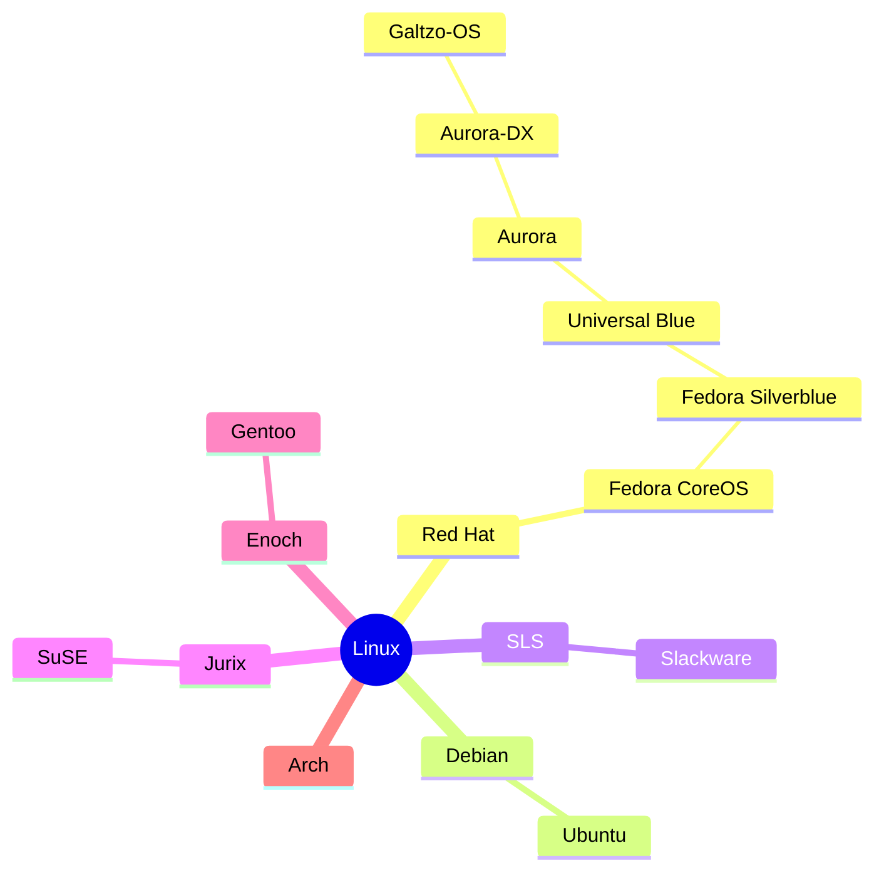

# galtzo-os &nbsp; [](https://github.com/pboling/galtzo-os/actions/workflows/build.yml)

This image is based on `aurora-dx:beta`. A new version / build is released daily.

The linux lineage of this spin therefore looks something like this:



NOTE: The `DX` means the "Developer Experience" flavor.

If you are unfamiliar with Universal Blue Linux, or Atomic Fedora,
start your journey at [universal-blue.org](https://universal-blue.org/), and download an image that suits you.

If you want to jump right into making your own spin (the water is fine!)
start with the [Blue Build Workshop](https://workshop.blue-build.org/),
a web tool that will create a repo like this one and build your first image.

Or see the [BlueBuild docs](https://blue-build.org/how-to/setup/) for quick manual setup instructions.

This particular configuration layers the following onto `aurora-dx-hwe`:

- NordVPN (also added to systemd) (config taken from [jlandahl/aurora](https://github.com/jlandahl/aurora))
- 1Password
- Ruby build dependencies (fedora specific)
  - autoconf
  - gcc
  - gcc-c++ (necessary for Ruby < 3.1)
  - rust # for oxide-rb, magnus, tree_stump & other crabby things
  - patch
  - make
  - bzip2
  - openssl-devel
  - libyaml-devel
  - libffi-devel
  - zlib-ng-compat-devel
  - readline-devel
  - gdbm-devel
  - ncurses-devel
  - perl-FindBin # Because of OpenSSL!
  - java-25 # for JRuby!
  - snapper
  - asusctl
  - asusctl-rog-gui
  - ghostty

## Installation

| ⚠️ **Warning**️ | [This is an experimental feature](https://www.fedoraproject.org/wiki/Changes/OstreeNativeContainerStable), try at your own discretion. |
| -------------- | -------------------------------------------------------------------------------------------------------------------------------------- |

To rebase an existing atomic Fedora installation to the latest build:

- First rebase to the unsigned image, to get the proper signing keys and policies installed:
  ```
  rpm-ostree rebase ostree-unverified-registry:ghcr.io/pboling/galtzo-os:latest
  ```
- Reboot to complete the rebase:
  ```
  systemctl reboot
  ```
- Then rebase to the signed image, like so:
  ```
  rpm-ostree rebase ostree-image-signed:docker://ghcr.io/pboling/galtzo-os:latest
  ```
- Reboot again to complete the installation
  ```
  systemctl reboot
  ```

The `latest` tag will automatically point to the latest build. That build will still always use the Fedora version specified in `recipe.yml`, so you won't get accidentally updated to the next major version.

## Update

Once you have this image installed updating to the latest is a two step process if you want to do it manually.

```bash
ujust update
systemctl reboot
```

Otherwise if you just reboot periodically updates will simply happen transparently in the background.
Generally there won't be more than one build per day, so a daily reboot will keep your system fresh.

## ISO

You can generate an offline ISO with the instructions available [here](https://blue-build.org/learn/universal-blue/#fresh-install-from-an-iso). These ISOs cannot unfortunately be distributed on GitHub for free due to large sizes, so for public projects something else has to be used for hosting.

## Verification

These images are signed with [Sigstore](https://www.sigstore.dev/)'s [cosign](https://github.com/sigstore/cosign). You can verify the signature by downloading the `cosign.pub` file from this repo and running the following command:

```bash
cosign verify --key cosign.pub ghcr.io/pboling/galtzo-os
```
